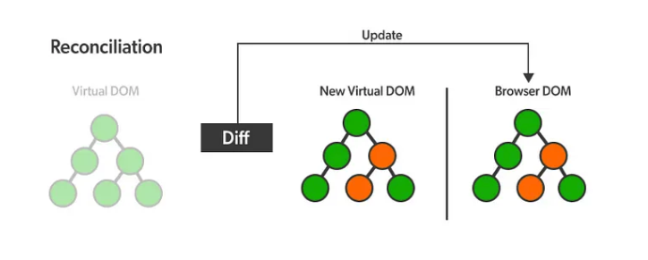
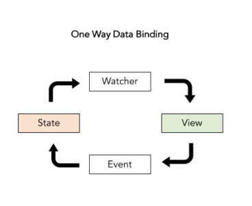

## 1.1 리액트란 무엇일까? 우리는 왜 리액트를 배워야 할까?

### 1.1.1 프레임워크와 라이브러리

프레임워크

- 개발자가 작업을 하기 위한 전체적인 툴 을 제공한다.
- 개발자는 틀 안에서 그 방식에 맞춰서 작업을 한다.

라이브러리

- 전체적인 틀이 아닌 하나의 기능만을 도구처럼 제공한다.
- 개발자는 필요한 도구(라이브러리)를 가져와서 사용한다.

### 1.1.2 **🤔**그러면 리액트는 무엇일까?

> `React`는 웹 프레임워크로, 자바스크립트 라이브러리의 하나로서 사용자 인터페이스를 만들기 위해 사용된다.
>
- `Reac`t는 Facebook에서 제공해주는 프론트엔드 라이브러리라고 볼 수 있다.
- 싱글 페이지 애플리케이션이나 모바일 애플리케이션의 개발 시 토대로 사용될 수 있다.

### 1.1.3 Anguler 와 Vue 대신에 리액트를 사용하는 이유는 무엇일까?

> 현재 프론트엔드 개발자들은 왜 리액트를 선택하는 걸까? 라고 한다면 리액트는 라이브러리 이기 때문이다.  `Anguler` 와 `Vue`는 프레임워크이다. 프레임워크는 기본적으로 자신들만의 문법을 제공한다. 하지만 React 는 오직 UI만을 만들기 위해 만들어진 라이브러리이다. 제어 권한이 프레임워크에 있냐, 개발자에 있냐가 현재 `React` 를 사용하게 된 이유이다. 유연하게 확장할 수 있으며 앱개발도 가능한 `React Native` 라는 기술도 보유하고 있고 메타 의 지속적인 관리 하에 큰 생태계가 활성화 되어있기 때문에 `React` 를 채택하게 되는 것이다.
>

---

## 1.2 리액트의 특징

- 빠른 업데이트와 렌더링 속도

  > 자바스크립트는 `DOM` 을 조작 할 수 있다. 하지만 DOM을 조작하는 동안에는 너무 많은 자원이 소모되며, 어플리케이션의 속도를 떨어트리게 된다. 또한 기존의 자바스크립트는 하나의 DOM를 조작하면 전체를 갱신, `Rerender` 하기 때문에 비효율적인 구조이다. 하지만 `React` 는 가상의 DOM, Virtual DOM을 만들고 변경사항이 생길 때 Virtual DOM과 DOM 간의 비교를 통해, 변경 사항만을 반영하는 방식으로 작업을 수행하여 앱의 효율성과 속도가 높다.
  
  

- 컴포넌트 구조

  > `Component`는 독립적인 단위의 소프트웨어 모듈이다.  즉, 소프트웨어를 독립적인 하나의 부품으로 만드는 방법이라고 볼 수 있습니다. `React`는 UI(View)를 여러 컴포넌트로 쪼개서 만든다. 한 페이지 내에서도 각 부분을 독립된 컴포넌트로 만들고, 이 컴포넌트를 조립해 화면을 구성한다.   컴포넌트 단위로 쪼개져 있기 때문에, 전체 코드를 파악하기가 상대적으로 쉽고, 이렇게 기능 단위, UI 단위로 캡슐화시켜 코드를 관리하기 때문에 재사용성이 높다. 따라서 애플리케이션이 복잡해지더라도 코드의 유지보수, 관리가 용이해지는 장점을 가진다.

- 재사용성

  > `Component`란 말 그대로 '부품', 즉 화면을 이루는 '요소'를 의미한다. 여러 요소들이 중첩되어 있는 복잡한 컴포넌트에서 몇 가지 컴포넌트를 추출하면, 화면이 어떻게 구성되는지 더 간결하고, 수정이 용이한 형태로 나타낼 수 있다. 또한 이 컴포넌트를 `props(파라미터)`에 따라 달라지는 하나의 **`템플릿`**이라고 생각한다면, 하나의 요소를 만들었을 때 화면의 여러 부분에서 재사용을 용이하게 할 수 있다는 장점도 크게 작용한다.

- 데이터 플로우

  > `React` 에서는 `State(상태)` 를 통해 `View(화면)` 를 업데이트 한다. 하지만 반대인 경우에는 업데이트를 바로 하지 못한다. 단방향 데이터 흐름 이기 때문에, `View` 로 `State`를 바꾸고 다시 `State`가 `View`를 업데이트 하는 식으로 흘러간다고 생각하면 된다. 양방향 데이터 바인딩 같은 경우에는 규모가 커질수록 데이터의 흐름을 추적 하기가 힘들기 때문에 단방향 흐름을 채택 했다고 생각하면 된다.

   