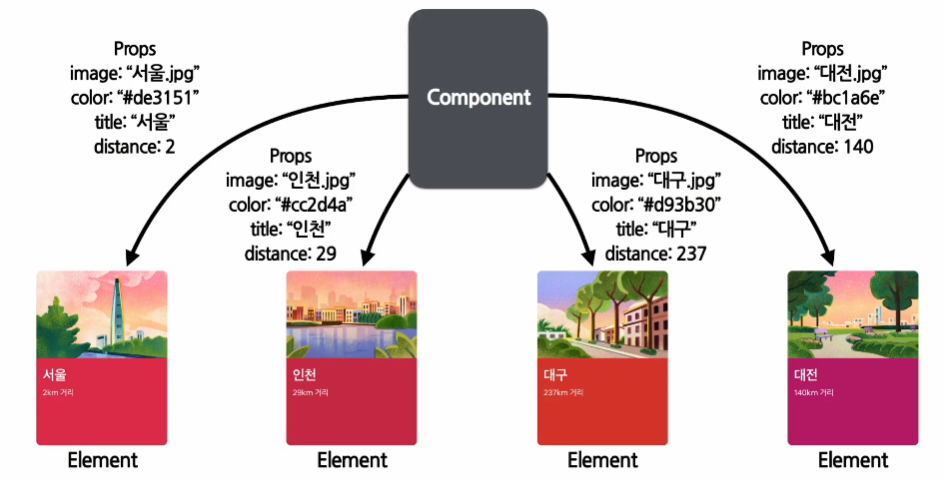
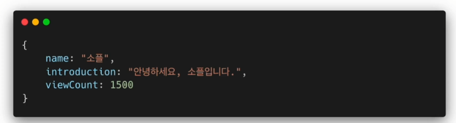
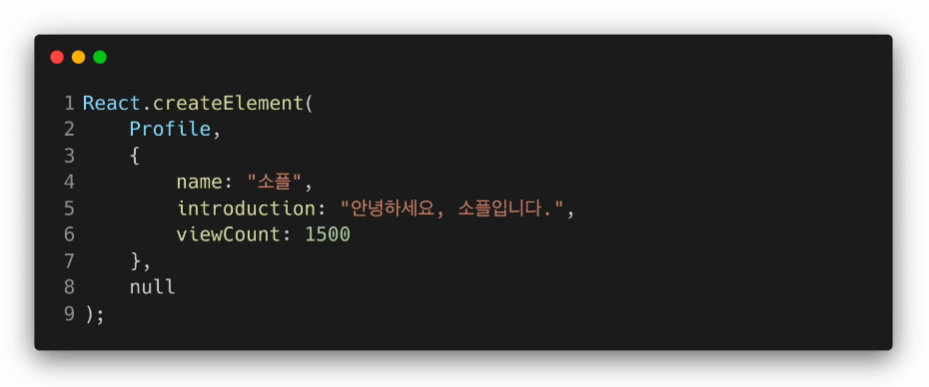
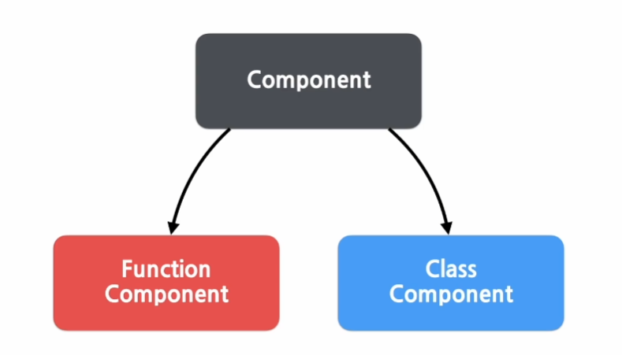

## [5.1] 컴포넌트에 대해 알아보기

### 리액트와 컴포넌트의 관계

- 리액트는 컴포넌트 기반의 구조를 갖고 있다
- 레고 블록을 조립하듯 컴포넌트들을 모아서 개발 되었다.
- 작은 컴포넌트들이 모여서 하나의 컴포넌트를 구성하고, 이러한 컴포넌트들이 모여서 전체 페이지를 구성하게 된다.
- **_하나의 컴포넌트를 반복적으로 사용함_** 으로써 전체 코드의 양이 줄고 **_개발 시간과 유지 보수 비용도 줄일 수 있다._**
<div style="display: flex; flex-direction: row; justify-content: center;">

</div>

### 컴포넌트의 역할

- 어떠한 **_속성들을 입력으로 받아서_** 그에 맞는 리액트 **_엘리먼트를 생성하여 리턴 해주는 것_** 이다
- **_엘리먼트_** : 리액트 앱을 구성하는 가장 작은 빌딩 블록

<div style="display: flex; flex-direction: row; width: 500px">
  
  
</div>

<br />

## [5.2] Props에 대해 알아보기

### Props의 개념

- property의 줄임 말이다
- **_리액트 컴포넌트의 속성_** 을 의미한다
- ex) 붕어빵을 예시로 하였을 때 붕어빵의 **_재료는 Props가 된다_**
- 컴포넌트에 전달한 다양한 정보를 담고 있는 자바스크립트 객체

### Props 예시

- 모두 동일한 Component를 이용하여 생성 되었으나, 모두 다른 Props를 할당 받았다

<div style="display: flex; flex-direction: row; justify-content: center;">

</div>

### Props의 특징

- Read-Only : 읽을 수만 있고 값을 변경할 수 없다
- 다른 props의 값으로 엘리먼트를 생성하려면 **_새로운 컴포넌트에 전달하여 새로 엘리먼트를 생성_** 해야한다
- 모든 리액트 컴포넌트는 **_Props를 직접 바꿀 수 없고_**, 같은 Props에 대해서는 **_항상 같은 결과를 보여줘야 한다_**

### Props 사용법

- JSX를 사용하는 경우에는 **_“키-값”_** 형태로 넘겨주게 된다
<div style="display: flex; flex-direction: row; justify-content: center; margin: 20px">

</div>

- **_createElement_** 를 이용해서 **_자바스크립트 객체를 사용_**하여 전달할 수 있다

<div style="display: flex; flex-direction: row; justify-content: center; margin: 20px;">

</div>
<br />

## [5.3] 컴포넌트 만들기

<div style="display: flex; flex-direction: row; justify-content: center; margin: 20px;">

</div>

### 컴포넌트의 종류

1. 함수 컴포넌트

   - 리액트의 컴포넌트는 일종의 함수이다
   - 아래의 예시에 있는 **_Welcome 함수_** 는 props 객체를 받아 인사말이 담긴 리액트 엘리멘트를 리턴하기 때문에 리액트 컴포넌트라고 할 수 있다
   - 이와 같은 형태를 **_함수 컴포넌트_**라고 한다
   <div style="display: flex; flex-direction: row; justify-content: center; margin: 20px;">
   
   </div>

2. 클래스 컴포넌트
   - 함수 컴포넌트와의 가장 큰 차이점은 **_리액트의 모든 클래스 컴포넌트는 React.Component를 상속 받아서 만든다_**
   - 아래의 **_Welcome 클래스_** 는 React.Component를 **_상속받아서 생성된 되었기 때문에_** 결과적으로 리액트 컴포넌트가 된다
   - 잘 사용하지 않는 방식이다
   <div style="display: flex; flex-direction: row; justify-content: center; margin: 20px;">
   
   </div>

### 컴포넌트 이름 짓기

- 컴포넌트의 이름은 항상 대문자로 시작해야된다
- 왜냐하면 리액트는 **_소문자로 시작하는 컴포넌트를 DOM 태그로 인식_** 하기 때문이다
<div style="display: flex; flex-direction: row; justify-content: center; margin: 20px;">

</div>

### 컴포넌트 렌더링

- 컴포넌트를 직접 렌더링 하는 것이 아니라 **_컴포넌트를 통해 생성된 엘리먼트를 렌더링_** 한다
- 생성된 엘리먼트는 최종적으로 **_React DOM을 통해 실제 DOM에 업데이트 되어 브라우저를 통해 보여지게 된다_**

  <br />

## [5.4] 컴포넌트 합성

- 여러 개의 컴포넌트를 합쳐서 **_하나의 컴포넌트를 만드는 것_** 이다
- Component안에 또 다른 Component를 쓸 수 있다.
- 재사용성이 높아지면 개발속도가 빨라진다

<div style="display: flex; flex-direction: row; justify-content: center; margin: 20px;">

</div>

```jsx
function Welcome(props) {
  return <h1> 안녕, {props.name}</h1>;
}

function App(props) {
  return (
    <div>
      <Welcome name="Mike" />
      <Welcome name="Steve" />
      <Welcome name="Jane" />
    </div>
  );
}
```

<br />

## [5.5] 컴포넌트 추출

- 합성과 반대로 복잡한 컴포넌트를 쪼개서 여러 개의 컴포넌트로 나눌 수 있다
- 큰 컴포넌트에서 일부를 추출해서 새로운 컴포넌트를 만든다
- 컴포넌트를 어느 정도 수준까지 추출하는 것이 좋은지에 대해서는 정해진 기준은 없다
- **_기능 단위로 구분하는 것이 좋고, 나중에 재사용이 가능한 형태로 추출하는 것이 좋다_**

<div style="display: flex; flex-direction: row; justify-content: center; margin: 20px;">


</div>
