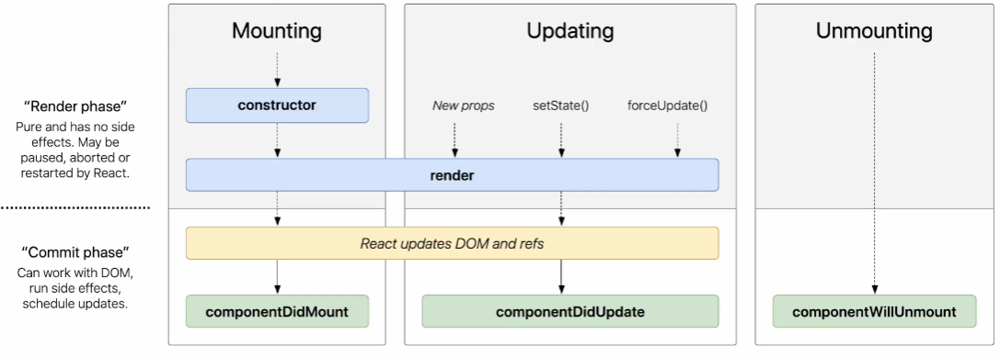

# 6강

## [6.1] State

### **State란?**

- 리액트 컴포넌트의 **_상태_** 를 의미한다
- 리액트 컴포넌트의 변경 가능한 데이터
- 렌더링이나 데이터 흐름에 사용되는 값만 state에 포함 시켜야 한다

### State의 특징

- state는 정의된 이후 변수를 다루듯이 직접 수정할 수 없다
- state를 변경하고자 할 때에는 꼭 **`setState()`** 함수를 사용해야한다

## [6.2] Life-cycle

- 리액트 컴포넌트의 **_생명주기_** 를 의미한다
- 리액트 컴포넌트는 생성되는 시점과 사라지는 시점이 정해져 있다
  

### Mount

- 리액트 컴포넌트가 생성되는 시점
- **`constructor`** 가 실행된다
- 생성자에서 컴포넌트의 state를 정의하게 된다
- 렌더링 이후에 **`componentDidMount()`** 함수가 호출 된다

### Update

- 리액트 컴포넌트가 업데이트 되는 과정
- 여러 번 렌더링 된다
- props가 변경되거나 **`setState()`** 함수 호출에 의해 state가 변경되거나, **`forceUpdate()`** 강제 업데이트 함수 호출로 인해 **_컴포넌트가 다시 렌더링 된다_**
- 렌더링 이후에 **`componentDidUpdate()`** 함수가 호출 된다

### Unmount

- 리액트 컴포넌트가 사라지는 과정
- **_상위 컴포넌트에서 현재 컴포넌트를 더 이상 화면에 표시하지 않게 되는 경우_**
- 언마운트 직전에 **`componentWillUnmount()`** 함수가 호출 된다

**_[ 컴포넌트가 계속 존재하는 것이 아니라 시간의 흐름에 따라 생성되고 업데이트 되다가 사라진다 ]_**
