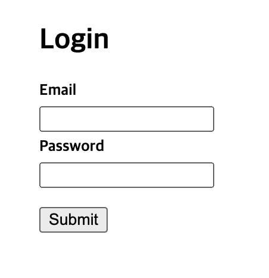

# 11장 폼

- **폼이란?**
    - 사용자로부터 입력을 받기 위해 사용하는 양식
        
        
        
    
- **제어 컴포넌트**
    - 사용자가 입력한 값에 접근하고 제어할 수 있게 해 주는 **컴포넌트**
    - 값이 리액트의 통제를 받는 입력 폼 **엘리먼트**
        
        
        
    - **input type=”text”태그**
        - **한 줄**로 텍스트를 입력 받기 위한 HTML 태그
        - 리액트에서는 **value**라는 **attribute**로 입력된 값을 관리
        
        ```jsx
        const [value, setValue] = useState('')
        
        const handleChange = (event) => {
        	setValue(event.target.value)
        }
        
        <input type="text" value={value} onChange={handleChange}/>
        ```
        
    - **textarea태그**
        - **여러 줄**에 걸쳐서 텍스트를 입력 받기 위한 **HTML** 태그
        - 리액트에서는 **value**라는 **attribute**로 입력된 값을 관리
        
        ```jsx
        <textarea value={value} onChange={handleChange}></textarea>
        ```
        
    - **select태그**
        - 드롭다운 목록을 보여 주기 위한 **HTML** 태그
        - 여러 가지 옵션 중에서 하나 또는 여러 개를 선택할 수 있는 기능을 제공
        - 리액트에서는 **value**라는 **attribute**로 선택된 옵션의 값을 관리
        
        ```jsx
        <select value={value} onChange={handleChange}>
        	<option value="apple">사과</option>
        	<option value="apple">바나나</option>
        	<option value="apple">포도</option>
        	<option value="apple">수박</option>
        </select>
        
        //다중으로 선택
        <select multiple={true} value={['B', 'C']}>
        ```
        
- **File input 태그**
    
    ```jsx
    <input type="file"/>
    ```
    
    - 디바이스의 저장 장치로부터 사용자가 **하나 또는 여러 개의 파일을 선택**할 수 있게 해 주는 HTML 태그
    - 서버로 파일을 업로드하거나 **자바스크립트의 File API**를 사용해서 파일을 다룰 때 사용
    - **읽기 전용**이기 때문에 리액트에서는 **비제어 컴포넌트**가 됨
- **여러 개의 입력 다루기**
    - 컴포넌트에 **여러 개의 state**를 **선언**하여 각각의 입력에 대해 사용하면 됨
    
    ```jsx
    const [haveBreakfast, setHaveBreakfast] = useState(true)
    const [numberOfGuest, setNumberOfGuest] = useState(2)
    
    const handleSubmit = (event) => {
    	alert(`아침식사 여부: ${haveBreakfast}, 방문객 수: ${numberOfGuest}`)
    	event.preventDefault()
    }
    
    return (
    	<form onSubmit={handleSubmit}>
    		<label>
    			<input
    				type="checkbox"
    				checked={haveBreakfast}
    				onChange={(event) => {
    					setHaveBreakfast(event.target.checked)
    				}}
    		</label>
    		<label>
    			<input
    				type="number"
    				checked={numberOfGuest}
    				onChange={(event) => {
    					setNumberOfGuest(event.target.value)
    				}}
    		</label>
    		<button type="submit">제출</button>
    	</form>
    )
    ```
    
- **Input Null Value**
    - value prop은 넣되 자유롭게 입력할 수 있게 만들고 싶을 경우, 값에 **undefined** 또는 **null**을 넣으면 됨
