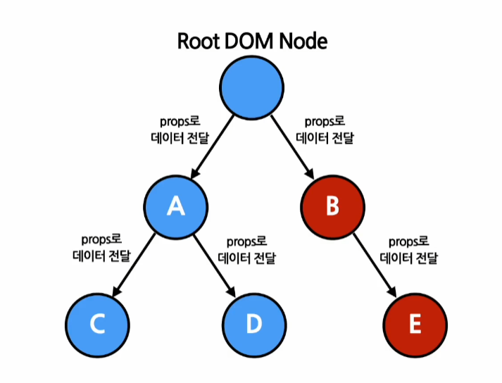

# 14. Context

---

## 1. Context ?

> 컴포넌트들 사이에서 데이터를 props를 통해 전달하는 것이 아닌 컴포넌트 트리를 통해 곧바로 데이터를 전달하는 방식
> 

- **기존 방식 vs Context**

 기존의 일반적인 React 애플리케이션에서는 데이터가 컴포넌트의 props를 통해 부모→자식 **단방향으로 전달**, 여러 컴포넌트를 자주 사용하는 데이터의 경우에는 이런 **단방향 전달 불편**

 이를 해결하기 위해 **Context**를 사용하는데 컨텍스트는 리액트 컴포넌트들 사이에서 데이터를 기존의 props를 통해 전달하는 방식 대신, **컴포넌트 트리를 통해 곧바로 컴포넌트에 전달**하는 새로운 방식을 제공한다.

 위의 그림처럼 컨텍스트에서 곧바로 데이터를 전달하는 방식이다. 이처럼 props를 일일이 하나씩 전달할 필요 없이 곧바로 데이터를 전달하므로, 코드도 매우 깔끔해지고 데이터를 한 곳에서 관리하기 때문에 디버깅하기도 매우 간편하며 유리하다.

 (위의 코드 처럼 같은 기능을 React.createContext() 함수를 이용해서 컨텍스트를 하나 생성하여 사용할 상위 컴포넌트에서 Provider로 감싸주어 Provider의 모든 하위 컴포넌트가 얼마나 깊이 위치해 있는지와 관계없이 컨텍스트의 데이터를 쉽게 읽어올 수 있다.)

 컨텍스트를 사용하면 좋은 데이터의 예로 로그인 여부, 로그인 정보, UI 테마, 현재 선택된 언어 등이 있다. 로그인을 예로 들었을 때, 로그인 상태와 로그아웃 상태의 차별 점이 있는 내비게이션 바의 경우 현재의 로그인 상태 데이터를 항상 받아와서 아이콘을 표시할 것이기 때문에, 컴포넌트에서 접근이 자주 일어날 가능성이 매우 높다. 

 컨텍스트를 무조건 사용하는 것은 좋은 것이 아니다. 컨텍스트는 컴포넌트와 연동되면 재사용성이 떨어지기 때문에 다른 레벨의 많은 컴포넌트가 데이터를 필요로 하는 경우가 아니라면 기존에 사용하던 방식대로 props를 통해 데이터를 전달하는 컴포넌트 합성 방법이 더 적합하다.

---

## 2. Context API

### 1) React.createContext

+) 상위 레벨에 매치되는 Provider가 없다면 기본 값이 사용,

    기본 값으로 undefined를 넣으면 기본 값이 사용되지 않음

### 2) Context.Provider

 Context.Provider 컴포넌트로 하위 컴포넌트들을 감싸주면 모든 하위 컴포넌트들이 해당 컨텍스트의 데이터에 접근할 수 있게 된다. Provider 컴포넌트에서 하위로 전달되어 받는 하위 컴포넌트들을Consumer 컴포넌트라고 한다.

컨텍스트는 재렌더링 여부를 결정 시 레퍼런스 정보를 사용하기에 Provider의 부모 컴포넌트가 재렌더링되었을 경우, 의도치 않게 Consumer 컴포넌트의 재렌더링이 일어남.

 따라서 위 코드와 같이 해당 컴포넌트의 value를 직접 넣는 것이 아닌 state로 옮기고 해당 state의 값을 넣어주어야 재렌더링을 막을 수 있다.

### 3) Class.contextType

 하위의 클래스 컴포넌트에서 컨텍스트의 데이터에 접근하기 위해 사용된다.

( 현재 거의 사용하지 않음 )

### 4) Context.Consumer

- 컨텍스트의 데이터를 구독하는 컴포넌트

컴포넌트의 자식의 함수 → **function as a child**

위의 코드처럼 함수를 감싸게 되면, 현재 컨텍스트의 value가 리액트 노드로 return

이때 함수로 전달되는 value는 Provider의 value prop과 동일, 만약 상위 컴포넌트에 Provider가 없다면 이 value 파라미터는 createContext() 의 기본값과 동일한 역할을 한다. 

### 5) Context.displayName

displayName 이라는 문자열 속성을 가짐. 개발자 도구에서 표시하고 싶은 이름을 작성

---

## 3. useContext() 훅

 함수 컴포넌트에서는 컨텍스트를 사용하기 위해 컴포넌트를 매번 Consumer 컴포넌트로 감싸주는 것보다 좋은 방법으로, 훅(Hook)이 있다.

useContext() 훅은 함수 컴포넌트에서 컨텍스트를 쉽게 사용할 수 있게 해준다. 

React.createContext() 함수 호출로 생성된 컨텍스트 객체를 인자로 받아서 현재 컨텍스트의 값을 리턴한다. 컴포넌트 트리 상 가장 가까운 상위 Provider로 부터 컨텍스트의 값을 받아온다. 

만약 컨텍스트의 값이 변경되면 변경된 값과 함께 useContext() 훅을 사용하는 컴포넌트가 재렌더링 된다. 따라서, useContext() 훅을 사용하는 컴포넌트의 렌더링이 꽤 무거운 작업일 경우에는 별도로 최적화 작업을 해줄 필요가 있다.
